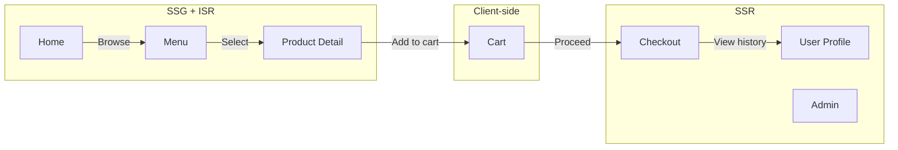
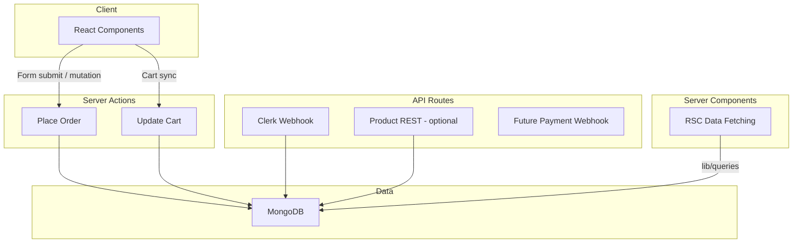
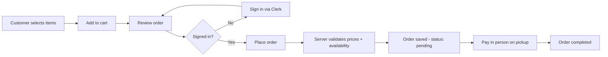
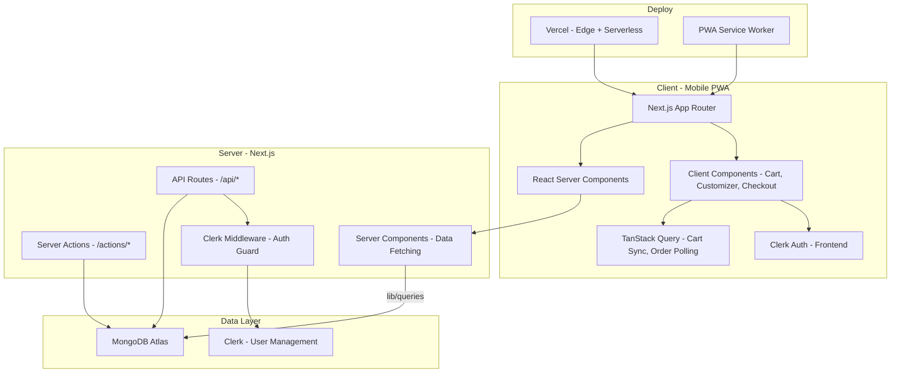
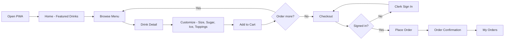
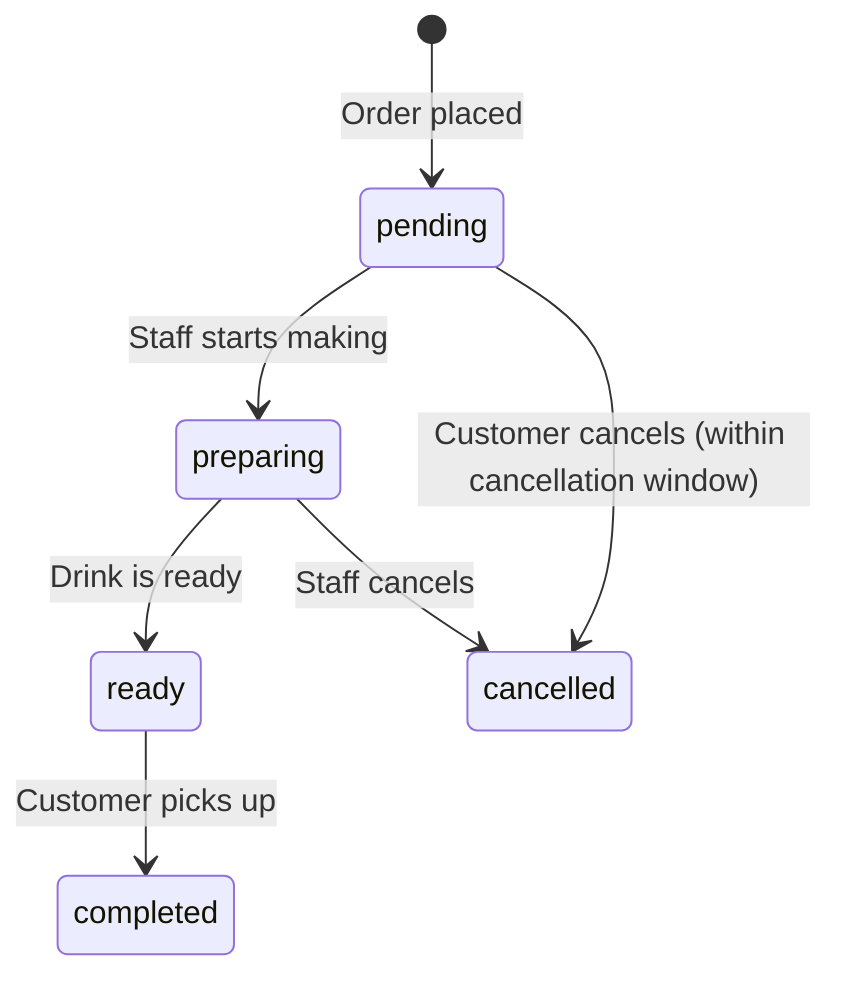

# Bubble Tea Shop — Next.js Project Plan

## Tech Stack Summary

| Category | Choice |
|---|---|
| **Framework** | Next.js 15 — App Router |
| **Language** | TypeScript — strict mode |
| **Styling** | Tailwind CSS + shadcn/ui |
| **Auth** | Clerk |
| **Database** | MongoDB + Mongoose (recommended for MongoDB-native schemas and middleware; Prisma with MongoDB adapter is an option if you prefer a unified query API or may add Postgres later) |
| **State** | TanStack Query for client-side interactive features (cart sync, order status polling); URL search params for filters. Server Components fetch data directly — no client cache needed for reads. |
| **Validation** | Zod in `shared` for types, API, and form validation |
| **Testing** | Vitest + React Testing Library (unit/component); Playwright optional for E2E |
| **Deployment** | Vercel |
| **Monorepo** | Turborepo with `web` + `shared` packages |
| **PWA** | Next.js native PWA support (`app/manifest.ts`, `public/sw.js` service worker, `web-push` for notifications). Use `@serwist/next` only if advanced offline caching (Workbox strategies) is needed — it requires webpack config. |
| **Currency** | `Intl.NumberFormat` with Money type (integer cents); English locale for v1 |
| **Env Validation** | `@t3-oss/env-nextjs` for type-safe environment variable validation |

---

## Rendering Strategy

For a bubble tea shop PWA, the best approach is a **hybrid**:

| Page | Strategy | Why |
|---|---|---|
| Home / Landing | **SSG + ISR** (revalidate every 3600s + on-demand `revalidateTag`) | Mostly static; fast first load; on-demand revalidation when menu changes via admin |
| Menu / Products | **SSG + ISR** (revalidate every 3600s + on-demand `revalidateTag('products')`) | Product catalog changes infrequently; great for SEO; explicit cache invalidation on product updates |
| Product Detail | **SSG + ISR** with dynamic params | Same reasoning; `generateStaticParams` for popular items |
| Cart | **Server Component shell + Client Component** | `cart/page.tsx` is a Server Component (for layout, metadata, nav); renders a `<CartView />` client component for interactivity. Persist cart in localStorage with `addedAt` timestamps; validate product availability on load; optional merge with user cart on sign-in |
| Checkout / Order | **SSR** (use `template.tsx` instead of `layout.tsx` to prevent stale form state) | Needs fresh user data, auth, real-time pricing |
| User Profile / Orders | **SSR** | Auth-gated, personalized |
| Admin (if any) | **SSR** | Auth-gated, role-protected via Clerk RBAC |

**Important — Next.js 15 caching change:** `fetch()` defaults to `no-store` in Next.js 15 (changed from `force-cache` in 14). Always explicitly set cache options: `fetch(url, { next: { revalidate: 3600, tags: ['products'] } })` in all data-fetching functions. Do not rely on defaults.



---

## Backend Patterns (API vs Server Actions)

- **Server Actions:** Use for mutations that don't need a public HTTP endpoint: place order, update cart (if any server-side cart sync). Keeps forms and logic colocated. Organize in `app/actions/` directory with `'use server'` directives.
- **API routes:** Use for webhooks (e.g., Clerk `api/webhooks/clerk`), future payment webhooks (e.g Polar.sh), and any external integrations that call your app via HTTP.
- **Products:** Served via Server Components + data layer (no REST required). Server Components call `lib/queries/` directly — they do NOT call API routes.



### Cache Invalidation Strategy

- Tag all product fetches with `'products'` tag: `fetch(url, { next: { tags: ['products'] } })`
- Tag order fetches with `'orders'` and user-specific tags: `'orders-{userId}'`
- After mutations, call `revalidateTag('products')` or `revalidatePath('/menu')` in Server Actions
- Admin product updates trigger `revalidateTag('products')` to bust ISR cache on-demand

### Error Handling

- **Server Actions:** `try/catch`, return typed result `{ success: boolean, message: string, data?: unknown }`, use `useActionState` on the client for form errors. Error messages linked to form fields via `aria-describedby`; error containers use `role="alert"`.
- **API routes:** `try/catch`, return proper HTTP status codes (400, 404, 500). Webhook routes verify signatures (see Security section).
- **Next.js 15 Route Handlers:** Note that async `params` must be `await`ed
- **Error boundaries:** Implement `error.tsx` as last-resort boundary with reset button

### Server-Side Validation (Critical)

- **Price recalculation:** The place-order Server Action MUST recalculate `totalPriceInCents` from product prices × quantities on the server. Never trust client-submitted totals.
- **Product availability:** Validate all products are still `available: true` at order time, not just at cart time. Return clear errors listing unavailable items.
- **Idempotency:** Generate a client-side idempotency key (UUID) sent with each order. The Server Action checks for existing orders with that key before creating a new one — prevents double-submit.

---

## Image Optimization

- **Next.js config:** `images.formats: ['image/avif', 'image/webp']`, optional `deviceSizes` / `imageSizes`
- **Next.js Image component:** Use with correct `sizes` prop for product grids: `(max-width: 640px) 50vw, (max-width: 1024px) 33vw, 25vw`
- **Priority loading:** Use `priority` and `fetchPriority="high"` only for above-the-fold images (e.g., first 4 product cards, PDP hero, home hero banner). Preload hero image in `<head>` via metadata API for LCP optimization.
- **Blur placeholders:** Add `placeholder="blur"` with `blurDataURL` where feasible
- **CLS prevention:** Always specify `width` and `height` on `<Image>` components. Use `aspect-ratio` CSS for responsive containers.

## Payments and Order Flow

- **v1:** Orders are "place order" only — pay in person or on pickup (no online payment).
- **Future (optional):** Add Polar.sh Checkout or Payment Intents in a later phase; design order creation with idempotency and webhook handling in mind so it's easy to attach payment later.



## Component Server/Client Designation

| Component | Type | Reason |
|-----------|------|--------|
| All `page.tsx` files | Server Component | Data fetching, metadata, layout |
| All `layout.tsx` files | Server Component | Shared layout structure |
| `Header.tsx` | Server Component | Static content, auth state via Clerk |
| `MenuGrid.tsx` | Server Component | Renders product list from server data |
| `ProductCard.tsx` | Server Component | Static display, no interactivity |
| `OrderSummary.tsx` | Server Component | Read-only display |
| `DrinkCustomizer.tsx` | Client Component | Interactive form, state management |
| `CartView.tsx` | Client Component | localStorage, interactive mutations |
| `CartItem.tsx` | Client Component | Quantity controls, remove actions |
| `BottomNav.tsx` | Client Component | Uses `usePathname()` for active state |
| `CheckoutForm.tsx` | Client Component | Form submission, `useActionState` |
| `MobileShell.tsx` | Server Component | Layout wrapper |

**Principle:** Scope `'use client'` to individual interactive components, not large UI subtrees. Keep the boundary as low in the tree as possible.

## Monorepo Structure

```
bubble-tea-app/
├── apps/
│   └── web/                          # Next.js app
│       ├── app/                      # App Router
│       │   ├── (shop)/               # Route group: public shop pages
│       │   │   ├── page.tsx          # Home
│       │   │   ├── menu/
│       │   │   │   ├── page.tsx      # Menu listing
│       │   │   │   └── [slug]/
│       │   │   │       └── page.tsx  # Product detail
│       │   │   ├── cart/
│       │   │   │   └── page.tsx
│       │   │   └── checkout/
│       │   │       ├── template.tsx  # Use template (not layout) to reset form state on navigation
│       │   │       └── page.tsx
│       │   ├── (auth)/               # Route group: auth pages
│       │   │   ├── sign-in/
│       │   │   └── sign-up/
│       │   ├── (user)/               # Route group: authenticated user
│       │   │   ├── profile/
│       │   │   └── orders/
│       │   ├── actions/              # Server Actions directory
│       │   │   ├── order.ts          # 'use server' — place order, cancel order
│       │   │   └── cart.ts           # 'use server' — cart sync mutations (if server-side)
│       │   ├── api/                  # API routes
│       │   │   ├── products/
│       │   │   ├── orders/
│       │   │   ├── cart/
│       │   │   └── webhooks/
│       │   │       └── clerk/
│       │   ├── layout.tsx
│       │   ├── loading.tsx
│       │   ├── error.tsx
│       │   └── not-found.tsx
│       ├── middleware.ts              # Clerk middleware with route matchers for (user), admin
│       ├── components/
│       │   ├── ui/                   # shadcn/ui components
│       │   ├── shop/                 # Shop-specific components
│       │   │   ├── ProductCard.tsx   # Server Component
│       │   │   ├── MenuGrid.tsx      # Server Component
│       │   │   ├── CartView.tsx      # Client Component — main cart UI
│       │   │   ├── CartItem.tsx      # Client Component
│       │   │   ├── DrinkCustomizer.tsx # Client Component
│       │   │   ├── CheckoutForm.tsx  # Client Component
│       │   │   └── OrderSummary.tsx  # Server Component
│       │   └── layout/
│       │       ├── BottomNav.tsx      # Client Component — mobile bottom navigation
│       │       ├── Header.tsx         # Server Component
│       │       ├── MobileShell.tsx    # Server Component
│       │       └── SkipNav.tsx        # Skip to main content link (accessibility)
│       ├── lib/
│       │   ├── db.ts                 # MongoDB connection (serverless singleton pattern)
│       │   ├── queries/              # Data access layer
│       │   ├── env.ts                # @t3-oss/env-nextjs typed env validation
│       │   └── utils.ts
│       ├── hooks/
│       ├── styles/
│       │   └── globals.css
│       ├── public/
│       │   ├── sw.js                 # Service worker for PWA (push notifications, optional offline)
│       │   └── icons/
│       ├── next.config.ts
│       ├── tailwind.config.ts
│       ├── tsconfig.json
│       └── package.json
├── packages/
│   └── shared/                       # Shared types, utils, constants
│       ├── src/
│       │   ├── types/
│       │   │   ├── product.ts
│       │   │   ├── order.ts
│       │   │   ├── cart.ts
│       │   │   └── user.ts
│       │   ├── constants/
│       │   │   ├── toppings.ts
│       │   │   ├── sizes.ts
│       │   │   └── sweetness-levels.ts
│       │   └── utils/
│       │       ├── price.ts
│       │       ├── currency.ts       # Money type, formatMoney, integer cents
│       │       └── validation.ts (Zod schemas)
│       ├── tsconfig.json
│       └── package.json
├── turbo.json
├── package.json                      # Root workspace
├── .env.local.example
├── .eslintrc.js
├── .prettierrc
└── README.md
```

---

## Architecture Diagram



---

## User Flow



---

## Data Models (MongoDB Collections)

These shapes can be backed by Zod schemas in `packages/shared` for validation and shared types.

### Product
```typescript
interface Product {
  _id: ObjectId
  name: string
  slug: string                        // unique index
  description: string
  basePriceInCents: number            // Store as integer cents to avoid floating-point errors
  category: 'milk-tea' | 'fruit-tea' | 'special' | 'classic'
  image: string
  available: boolean
  customizations: Array<{
    type: 'size' | 'sugar' | 'ice' | 'topping'  // Extensible — add new types without schema migration
    options: Array<{
      name: string
      priceModifierInCents: number    // 0 for non-priced options like sugar/ice levels
    }>
  }>
  createdAt: Date
  updatedAt: Date
}
```

### Order
```typescript
interface Order {
  _id: ObjectId
  orderNumber: string               // Human-readable pickup number (e.g., "#A042")
  idempotencyKey: string            // Client-generated UUID to prevent double-submit
  userId: string                    // Clerk user ID
  items: Array<{
    productId: ObjectId
    name: string
    size: string
    sugar: string
    ice: string
    toppings: string[]
    quantity: number
    unitPriceInCents: number        // Price per unit in cents (server-calculated)
  }>
  totalPriceInCents: number          // Total price in cents (server-calculated, never trust client)
  status: 'pending' | 'preparing' | 'ready' | 'completed' | 'cancelled'
  estimatedReadyAt?: Date            // When the order is expected to be ready for pickup
  createdAt: Date
  updatedAt: Date
}
```

### User
```typescript
interface User {
  _id: ObjectId
  clerkId: string                   // unique index — synced from Clerk webhooks
  email: string
  name: string
  phone?: string
  createdAt: Date
  updatedAt: Date
}
```

### MongoDB Indexes

```
Product:
  { slug: 1 }                      — unique
  { category: 1, available: 1 }    — menu filtering
  { available: 1 }                 — availability queries

Order:
  { userId: 1, createdAt: -1 }     — order history
  { status: 1 }                    — staff dashboard filtering
  { createdAt: -1 }                — recent orders
  { idempotencyKey: 1 }            — unique, dedup check
  { orderNumber: 1 }               — unique, lookup by pickup number

User:
  { clerkId: 1 }                   — unique
```



**Currency Display:** Use shared `formatMoney(money, locale?)` utility (based on `Intl.NumberFormat`) to convert cents to formatted currency strings for display.

**Order Cancellation Policy:** Orders can only be cancelled by the customer while in `pending` status. Staff can cancel from `pending` or `preparing`.

---

## MongoDB Connection (Serverless Singleton)

The `lib/db.ts` file must use a cached connection pattern to avoid connection exhaustion on Vercel serverless:

```typescript
// lib/db.ts
import mongoose from 'mongoose';

const globalForMongoose = globalThis as unknown as {
  mongoose: { conn: typeof mongoose | null; promise: Promise<typeof mongoose> | null };
};

const cached = globalForMongoose.mongoose ?? { conn: null, promise: null };
globalForMongoose.mongoose = cached;

export async function connectDB() {
  if (cached.conn) return cached.conn;
  if (!cached.promise) {
    cached.promise = mongoose.connect(process.env.MONGODB_URI!, {
      bufferCommands: false,
      maxPoolSize: 10,
    });
  }
  cached.conn = await cached.promise;
  return cached.conn;
}
```

Monitor MongoDB Atlas connection limits. Free/shared tier has a 500-connection limit.

---

## Query Optimization Patterns

Always use `.lean()` for read queries (returns plain objects, 5-10x faster than Mongoose documents):

```typescript
// Menu page
Product.find({ available: true })
  .select('name slug basePriceInCents image category')
  .lean()

// Product detail
Product.findOne({ slug })
  .lean()

// Order history
Order.find({ userId })
  .sort({ createdAt: -1 })
  .limit(20)
  .lean()
```

---

## Streaming & Suspense Boundaries

Beyond the root `loading.tsx`, implement granular Suspense boundaries within pages:

```tsx
// app/(shop)/menu/page.tsx
import { Suspense } from 'react';

export default function MenuPage() {
  return (
    <>
      <CategoryFilter />  {/* Renders immediately */}
      <Suspense fallback={<ProductGridSkeleton />}>
        <MenuGrid />       {/* Streams when data is ready */}
      </Suspense>
    </>
  );
}
```

Use `next/dynamic` with `{ ssr: false }` for heavy client components:
- `DrinkCustomizer` (heavy interactive component)
- PWA install prompt
- Any future chart/analytics components

---

## Security

### Webhook Signature Verification (Required)

Clerk webhook signatures MUST be verified using `svix`. Without this, anyone can POST fake user data to your webhook endpoint:

```typescript
// app/api/webhooks/clerk/route.ts
import { Webhook } from 'svix';
import { headers } from 'next/headers';

export async function POST(req: Request) {
  const WEBHOOK_SECRET = process.env.CLERK_WEBHOOK_SECRET!;
  const headerPayload = await headers();
  const svix_id = headerPayload.get('svix-id');
  const svix_timestamp = headerPayload.get('svix-timestamp');
  const svix_signature = headerPayload.get('svix-signature');

  const body = await req.text();
  const wh = new Webhook(WEBHOOK_SECRET);
  const evt = wh.verify(body, {
    'svix-id': svix_id!,
    'svix-timestamp': svix_timestamp!,
    'svix-signature': svix_signature!,
  });
  // Process verified event...
}
```

### Input Sanitization

- Mongoose's built-in query sanitization is enabled by default
- Zod validates shape/type on all inputs
- React's JSX escaping prevents XSS for rendered content
- Never use `dangerouslySetInnerHTML` with user-generated content

### Admin Route Protection

Use Clerk's role-based access control:
- Define `admin` role in Clerk dashboard
- Check `(await auth()).sessionClaims?.metadata?.role === 'admin'` in Server Components (note: `auth()` is async in Next.js 15 / Clerk v5+)
- Protect admin routes in `middleware.ts`

### CSRF Protection

- Server Actions have built-in CSRF protection (POST-only, same-origin)
- API routes used by the frontend should validate the `Origin` header or prefer Server Actions
- Webhook routes verify signatures (see above)

---

## Setup Steps (Todo List for Implementation)

1. **Initialize Turborepo monorepo** with `web` app and `shared` package
2. **Set up ESLint + Prettier** (early to enforce consistent formatting from the start)
3. **Set up Next.js 15** with App Router, TypeScript strict, Tailwind CSS
4. **Install and configure shadcn/ui** (init + base components)
5. **Create shared package** with types, **Zod schemas**, constants (sizes, toppings, sweetness levels), and **currency utilities** (Money type, formatMoney, integer cents)
6. **Set up MongoDB** connection with **serverless singleton pattern** (Mongoose)
7. **Build data models** (Product, Order, User schemas) with integer cents storage and **indexes**
8. **Seed database** with sample bubble tea products (needed before building UI pages)
9. **Set up Clerk** authentication (middleware.ts, sign-in/sign-up pages, webhook with **signature verification**, User sync)
10. **Configure environment variables** (`.env.local`) with MongoDB URI, Clerk keys, webhook secret. Set up `@t3-oss/env-nextjs` for type-safe validation.
11. **Build layout** — mobile shell with bottom nav, header, **skip navigation link**, **manifest.json** + PWA meta tags
12. **Build Home page** — featured drinks, hero banner with `priority` image
13. **Build Menu page** — category filter, product grid with ISR + `revalidateTag('products')`; **Suspense boundary** around product grid; **use Next.js Image with lazy loading, correct `sizes`, and `priority` only for above-the-fold images**
14. **Build Product Detail** — drink customizer (size, sugar, ice, toppings) with `next/dynamic`; **use Next.js Image with appropriate loading and sizes**; **dynamic `generateMetadata()`** with product name, description, OG image
15. **Build Cart** — client-side cart state in `CartView` client component, **persist in localStorage** with `addedAt` timestamps, validate product availability on load, optional merge with user cart on sign-in (strategy: localStorage wins, sum quantities for duplicates, cap at 10 per item)
16. **Build Checkout** — order placement with `template.tsx`, auth gate, **idempotency key**, **server-side price recalculation**, **product availability validation**; **ensure minimum accessibility: semantic HTML, labels, ARIA live regions for cart, keyboard nav, focus indicators, `aria-describedby` for form errors**
17. **Build User pages** — profile, order history
18. **Create Server Actions** (`app/actions/`) for order placement and cart mutations; **API routes** for webhooks (Clerk with signature verification) and optional product/orders REST; implement **error handling** with typed results and proper HTTP status codes; add `error.tsx` as last-resort boundary
19. **Add PWA support** — Next.js native `app/manifest.ts`, `public/sw.js` service worker, `web-push` for push notifications, icons. Add `@serwist/next` only if offline caching is needed.
20. **Add SEO** — metadata API, Open Graph, **dynamic `generateMetadata()`** per route, **JSON-LD structured data** (`Product` schema, `LocalBusiness` schema)
21. **Deploy to Vercel**

---

## SEO & Metadata Strategy

Define metadata per route:

| Route | Metadata Type | Details |
|-------|--------------|---------|
| Home | Static `metadata` export | Site name, description, OG image |
| Menu | Static `metadata` export | Category in title, menu description |
| Product Detail | Dynamic `generateMetadata()` | Product name, description, OG image from product image |
| Cart / Checkout | Static `metadata` export | `robots: { index: false }` — no indexing |
| User pages | Static `metadata` export | `robots: { index: false }` — no indexing |

### Structured Data (JSON-LD)

Add to product detail pages:
```json
{
  "@context": "https://schema.org",
  "@type": "Product",
  "name": "Taro Milk Tea",
  "description": "...",
  "image": "...",
  "offers": {
    "@type": "Offer",
    "price": "5.50",
    "priceCurrency": "USD"
  }
}
```

Add to root layout:
```json
{
  "@context": "https://schema.org",
  "@type": "LocalBusiness",
  "name": "Bubble Tea Shop",
  "address": { ... }
}
```

---

## Design Notes (from existing research)

Following the **Chagee / Heytea / 阿嬷手作** aesthetic:
- **Warm, soft palette** — cream, soft green, muted brown/red
- **Large product photos** — appetizing, clean cards
- **Bottom tab navigation** — Home, Menu, Cart, Profile
- **Minimal UI** — whitespace, clear typography, few taps to order
- **Touch-first** — large tap targets, sticky bottom CTA bars
- **Light animations** — cart updates, page transitions; **use Tailwind `motion-safe:` and `motion-reduce:` variants** for all animations to respect `prefers-reduced-motion`

---

## Accessibility (Minimum Viable)

- **Target WCAG 2.1 Level AA** as the baseline
- **Skip navigation:** Add `<a href="#main" className="sr-only focus:not-sr-only">Skip to main content</a>` as the first element in root layout
- **Semantic HTML** (forms, tables, nav) for proper structure
- **Form labels:** All form fields must have visible `<label>` elements with `for` attributes and `autocomplete` where applicable (checkout forms)
- **Form error accessibility:** Use `aria-describedby` linking form fields to their error messages; use `role="alert"` on error containers
- **ARIA live regions:** Use `role="status"` and `aria-live="polite"` for cart updates and notifications
- **Keyboard navigation:** All interactive elements must be focusable with visible focus indicators (`:focus-visible`)
- **Focus management on route changes:** Move focus to the `<h1>` of the new page on navigation, or use `aria-live` to announce the new page title
- **Product images:** Provide meaningful `alt` text describing the drink
- **Error prevention:** Include order review step before final submission for financial transactions
- **Color contrast:** Ensure sufficient contrast ratios for text and interactive elements
- **Touch targets:** Minimum 44x44px for touch interactions
- **Reduced motion:** Use Tailwind `motion-safe:` / `motion-reduce:` variants for all animations (zero-cost to implement upfront)

---

## Cart Edge Cases

| Scenario | Behavior |
|----------|----------|
| **Cart merge on sign-in** | localStorage cart wins. Combine items, sum quantities for duplicates, cap at 10 per item. |
| **Cart expiry** | Each cart item has an `addedAt` timestamp. On cart load, validate all items against current product availability. Show a toast for removed/unavailable items. |
| **Product unavailable at order time** | Place-order Server Action validates all products are `available: true`. Returns error listing unavailable items. |
| **Double-submit prevention** | Client generates a UUID idempotency key per order attempt. Server checks for existing orders with that key before creating. |
| **Cancelled product between cart and checkout** | Same as unavailability — server-side validation catches this. |

---

## Explicit Exclusions

These items are intentionally NOT included in v1 to keep the scope focused on the MVP:

| Item | Reason |
|------|--------|
| Custom CDN image loaders (Cloudinary, Imgix) | Out of scope; use Next.js built-in optimization |
| axe-core, pa11y, Lighthouse in CI | Out of scope for plan; can be added later |
| Error logging/monitoring (Sentry, PostHog) | Minimal setup only; consider Vercel's built-in analytics (free) |
| Multi-language (next-intl, locale switching) | User: stick to English for now |
| Currency conversion / exchange rates | Not needed for single-currency v1 |
| Performance monitoring dashboards | Out of scope |
| Complex CI/CD pipeline | Out of scope; use Vercel's built-in preview/production deployments |
| Rate limiting | Out of scope for MVP; consider `upstash/ratelimit` post-launch if abuse occurs |

---

## Testing Strategy

- **Unit tests:** Core logic, data models, utilities in `shared` package using Vitest
- **Component tests:** UI components with React Testing Library
- **Integration tests:** Server Actions, API routes, database operations
- **E2E tests:** Critical user flows (ordering, checkout) with Playwright (optional for v1)
- **Accessibility testing:** Manual testing with screen readers and keyboard navigation

---

## Performance Considerations

- **Bundle splitting:** Separate vendor and app code
- **Code splitting:** Lazy load non-critical components with `next/dynamic` (`DrinkCustomizer`, PWA install prompt)
- **Image optimization:** Use Next.js built-in optimization with WebP/AVIF formats; always specify `width`/`height` for CLS prevention
- **Caching:** ISR with 3600s revalidation + on-demand `revalidateTag` for product updates. Explicit `fetch` cache options (Next.js 15 defaults to `no-store`).
- **Database queries:** Optimize MongoDB queries with indexes (see Data Models section). Always use `.lean()` for read queries.
- **Server Actions:** Minimize payload size for mutations
- **Streaming:** Use granular `<Suspense>` boundaries within pages for progressive rendering
- **TanStack Query scope:** Only used for client-side interactive features (cart sync, order status polling). Product/menu data fetched in Server Components — no client cache overhead.
- **LCP optimization:** Hero images use `priority` + `fetchPriority="high"`, preloaded in `<head>` via metadata API

---

## Implementation Guidance (From Review)

The following items were identified during plan review as important considerations. They are organized as guidance for implementation — research the latest docs and APIs before building each one.

### 1. Error Monitoring & Logging Strategy

**What:** Add production error tracking for Server Action failures, API route errors, and unhandled exceptions.

**Implementation steps:**
- Research Vercel's built-in error/analytics dashboard (free tier) — determine if it covers Server Action failures or only edge/serverless function errors.
- If insufficient, evaluate Sentry's free tier for Next.js 15 App Router — check if their SDK supports Server Actions and RSC natively.
- Add a `lib/logger.ts` utility that wraps `console.error` in dev and sends to the chosen provider in production.
- Instrument the `error.tsx` boundary and all Server Actions' `catch` blocks to call the logger.
- Log: error message, stack trace, user ID (if authenticated), action name, timestamp.

### 2. Order Notifications

**What:** Customers receive confirmation when an order is placed; staff are alerted to new orders.

**Implementation steps:**
- **Customer email:** Clerk only handles auth-related emails (verification, password reset, etc.) — it does NOT support custom business transactional emails like order confirmations. Use **Resend** (free tier: 100 emails/day, 3,000/month) with `react-email` for templated order confirmation emails. Resend has first-class Next.js integration and a generous free tier for a small shop.
- **Staff alerts:** Determine the simplest channel — email to a shared inbox via Resend, or a webhook to Discord/Slack. Start with email; a Slack webhook is a single `fetch` call.
- Add a `lib/notifications/` module with `notifyCustomer(order)` and `notifyStaff(order)` functions.
- Call these from the place-order Server Action after successful order creation.
- For v1, email-only is fine. Push notifications are a future enhancement.

### 3. Taxes, Tips, and Service Fees

**What:** Define how tax is calculated and displayed, and whether tips or fees apply.

**Implementation steps:**
- Decide on tax model: fixed percentage per locale, or tax-inclusive pricing.
- Add tax fields to the Order model: `subtotalInCents`, `taxInCents`, `taxRate` (stored as decimal, e.g., `0.08` for 8%).
- Add a `calculateTax(subtotalInCents, taxRate): number` utility in `packages/shared/src/utils/price.ts`.
- The place-order Server Action calculates tax server-side (never trust client).
- Display tax as a separate line item on checkout and order confirmation.
- **Tips:** If needed, add an optional `tipInCents` field to Order. Implement a tip selector UI in `CheckoutForm.tsx` (preset percentages + custom amount).
- **Service fees:** If applicable, add `serviceFeeInCents` to Order and define the fee logic in the shared utils.

### 4. Time Zone & Pickup Window

**What:** Handle store hours, estimated pickup times, and time zone differences between server and customer.

**Implementation steps:**
- Define store hours as a config constant in `packages/shared/src/constants/store-hours.ts` — array of `{ day, open, close }` objects.
- Add a `isStoreOpen(now: Date, timezone: string): boolean` utility.
- Add an `estimatePickupTime(orderTime: Date, queueLength: number): Date` utility — simple estimate based on current pending/preparing order count × average prep time.
- Store all dates in UTC in MongoDB. Convert to the store's local timezone for display using `Intl.DateTimeFormat` with an explicit `timeZone` option.
- Show "Store is currently closed" on the checkout page when outside hours, with next opening time.
- Display estimated pickup time on order confirmation.

### 5. Per-Option Inventory / Availability

**What:** Track when specific customization options sell out (e.g., a topping runs out).

**Implementation steps:**
- Add an optional `available: boolean` field to each option within `Product.customizations[].options[]`. Default `true`.
- In the `DrinkCustomizer.tsx` component, visually disable and mark unavailable options (greyed out + "Sold out" label).
- The place-order Server Action validates that all selected options are still available (not just the product itself).
- Admin can toggle option availability — this triggers `revalidateTag('products')` to update cached pages.
- **Keep it simple for v1:** This is an optional enhancement. Start with product-level availability only; add option-level later if needed.

### 6. Order Number Generation

**What:** Generate human-readable, collision-safe order numbers for pickup.

**Implementation steps:**
- Research strategies: date prefix + daily sequence (e.g., `#0216-042`), or letter prefix + daily counter (e.g., `#A042`).
- Implement using a MongoDB atomic counter: a separate `Counter` collection with `{ _id: 'dailyOrder', date: '2026-02-16', seq: 42 }`.
- Use `findOneAndUpdate` with `$inc: { seq: 1 }` and `upsert: true` to atomically increment.
- Reset counter daily (the `date` field ensures a new document per day).
- Format: `#${letterPrefix}${seq.toString().padStart(3, '0')}` — e.g., `#A042`.
- Add this to `lib/utils/order-number.ts`.

### 7. Data Backup Strategy

**What:** Ensure MongoDB data is backed up for production.

**Implementation steps:**
- **MongoDB Atlas M0 (free tier) has NO built-in backups.** Atlas Cloud Backups (snapshots, point-in-time recovery) are only available on M10+ dedicated clusters. The M0 free tier only supports manual backups via `mongodump`/`mongorestore`.
- **Atlas Flex clusters** (replaced M2/M5 as of May 2025) have automatic daily snapshots enabled by default — this is the cheapest tier with built-in backups. Consider upgrading to Flex if the app needs automated backups.
- **For M0 free tier:** Use `mongodump` to create manual backups. Consider a scheduled backup script (e.g., a Vercel Cron job or GitHub Action that runs `mongodump` and uploads to cloud storage like S3 or GCS).
- **For production at scale:** Upgrade to M10+ for Cloud Backups with configurable snapshot schedules and point-in-time recovery.
- Document the chosen backup strategy in `README.md` once set up.

---

## Future Enhancements

- **Online payments:** Polar.sh integration for card payments
- **Multi-currency support:** Add currency conversion and locale switching
- **Advanced analytics:** User behavior tracking and conversion optimization
- **Push notifications:** Order status updates and promotions
- **Loyalty program:** Points system and rewards
- **Admin dashboard:** Product management and order tracking (consider parallel routes)
- **Multi-language support:** Internationalization for broader reach
- **Product quick-view:** Intercepting routes for modal-based product preview
- **Rate limiting:** `upstash/ratelimit` for order creation endpoint
- **MongoDB migrations:** `migrate-mongo` for schema evolution tracking
